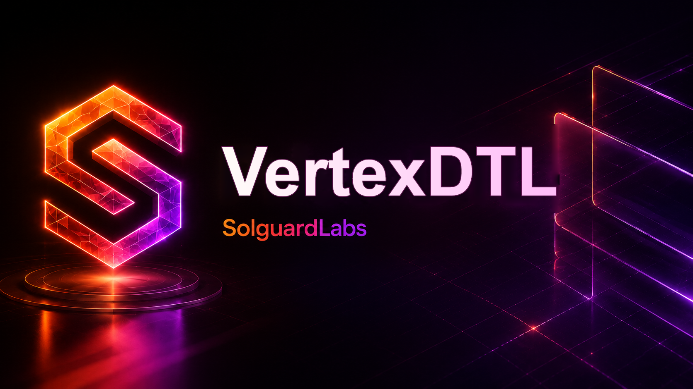

# Vertex DTL



Vertex DTL es un motor de liquidacion determinista escrito en Rust para flujos
de pago diferido entre cuentas autenticadas. El protocolo modela tickets
firmados, rutas de ejecucion, cargos operativos y liberaciones autorizadas sobre
un ledger local con conservacion de suministro.

El proyecto esta pensado como una implementacion compacta de referencia para
validar reglas de liquidacion, serializacion canonica y consistencia de estado
en entornos de integracion Web3.

## Caracteristicas principales

- Ledger determinista con digest de estado reproducible.
- Cuentas derivadas desde identidades publicas verificables.
- Tickets de pago firmados por el pagador.
- Solicitudes de liberacion firmadas por el beneficiario.
- Rutas de liquidacion con operador, receptor de comision y receptor de rebate.
- Nonces independientes para apertura de tickets y liberaciones.
- Deteccion de transacciones duplicadas mediante identificadores derivados.
- Comprobacion de conservacion de suministro tras cada mutacion critica.
- Reportes JSON estables para escenarios de integracion.

## Arquitectura

El codigo esta organizado por dominios funcionales:

- `src/amount`: tipos de importe y calculo en basis points.
- `src/codec`: serializacion canonica usada para digests e identificadores.
- `src/crypto`: identidades, claves y verificacion de firmas Ed25519.
- `src/error`: errores de dominio del protocolo.
- `src/ids`: identificadores de cuentas, activos, tickets, transacciones y
  digests.
- `src/ledger`: estado contable, journal, cuentas y transiciones de tickets.
- `src/settlement`: terminos de tickets, politicas de ruta y liberaciones.
- `src/runtime`: CLI y escenarios reproducibles.

## Flujo de liquidacion

1. El ledger se inicializa con un `network_id`, un activo nativo y cuentas
   registradas.
2. El pagador crea un `TicketTerms` con importe, beneficiario, activo, nonce y
   politica de ruta.
3. El ticket se firma dentro del dominio `vertex-ticket-open-v3`.
4. El ledger abre el ticket, debita al pagador y bloquea el importe.
5. El beneficiario observa la ruta, firma un `ReleaseRequest` dentro del dominio
   `vertex-ticket-release-v3` y solicita la liquidacion.
6. El ledger valida firmas, nonces, digest de ruta, estado del ticket y
   conservacion de suministro.
7. La liquidacion acredita beneficiario, operador y receptor de rebate segun el
   plan de ruta.

## Escenarios disponibles

El binario acepta un argumento opcional de escenario. Si no se indica ninguno,
ejecuta `routed`.

```bash
cargo run --locked -- direct
cargo run --locked -- routed
cargo run --locked -- batch
cargo run --locked -- snapshot
```

Cada escenario emite un reporte JSON con:

- `scenario`: nombre del escenario ejecutado.
- `network_id`: identificador de red.
- `asset`: activo liquidado.
- `ticket_id`: identificador del ticket, cuando aplica.
- `open_tx`: transaccion de apertura, cuando aplica.
- `release_tx`: transaccion de liberacion, cuando aplica.
- `balances`: saldos finales por rol.
- `total_supply`: suministro total registrado.
- `state_digest`: digest final del ledger.
- `conservation_ok`: resultado de la comprobacion contable.

## Requisitos

- Rust `1.96.0`.
- Bun `1.3.0` o superior.
- Node.js `24` recomendado para herramientas auxiliares.

## Instalacion

```bash
bun install --frozen-lockfile
cargo build --all-targets --locked
```

## Comandos de desarrollo

```bash
bun run test        # tests JavaScript sobre la CLI
bun run test:rust   # tests Rust
bun run test:all    # tests Rust y JavaScript
bun run fmt         # formato JavaScript
bun run fmt:check   # verificacion de formato JavaScript
bun run build       # verificacion de sintaxis JavaScript
bun run ci          # pipeline local completo
```

Tambien se incluyen scripts POSIX equivalentes:

```bash
bash scripts/tests.sh
bash scripts/ci.sh
```

En Windows, se recomienda ejecutarlos desde Git Bash. Desde PowerShell, `bun run
ci` y `bun run test:all` son las rutas mas directas.

## Calidad y CI

El workflow de GitHub Actions ejecuta:

- `bun install --frozen-lockfile`
- `cargo fmt --all -- --check`
- `cargo build --all-targets --locked`
- `cargo test --locked`
- `cargo clippy --all-targets --all-features --locked -- -D warnings`
- `bun run fmt:check`
- `bun run build`
- `bun test --timeout 30000 ./tests/node`

Dependabot esta configurado para revisar dependencias de Cargo, Bun y GitHub
Actions semanalmente.

## Estado del proyecto

Vertex DTL es una implementacion de referencia y no debe tratarse como
infraestructura lista para produccion sin revision independiente, modelado
formal de invariantes y auditoria externa completa.
